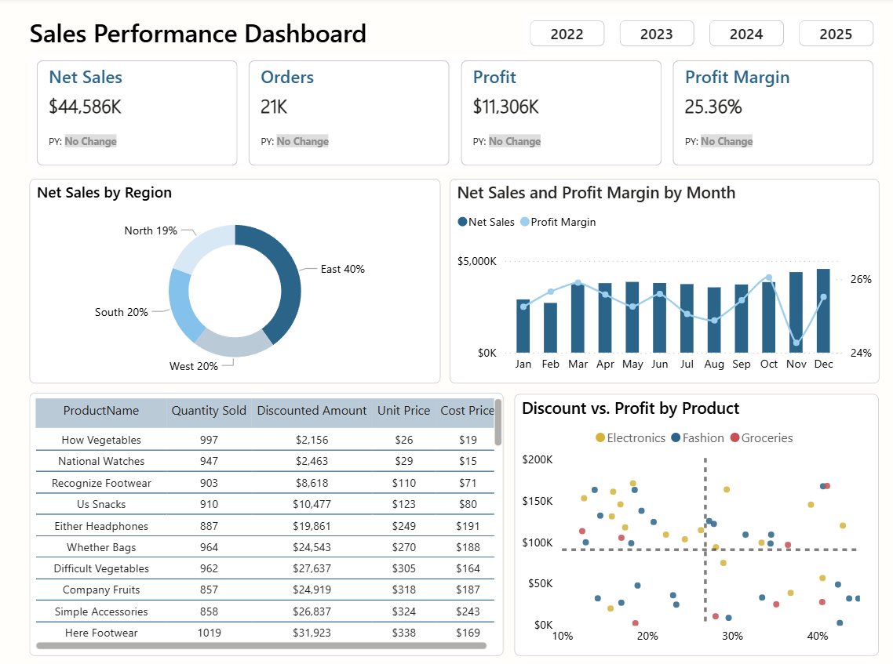

# Retail Sales Dashboard

A Power BI dashboard analyzing retail sales performance across regions, products, and time periods.

## Data Source

The dataset is based on retail sales data from 2022-2024. Since the original data had missing values and incomplete months, I used ChatGPT to generate normalized, realistic artificial rows to extend the dataset for complete analysis.

## Tools & Methods

**Tools Used:**
- Power BI Desktop
- Power Query (M language)
- DAX (Data Analysis Expressions)

**Methods:**
- **ETL Process**: Cleaned and transformed raw data using Power Query
- **Data Modeling**: Built a star schema with dimension tables (Date, Products, Stores) and a fact table (Sales)
- **Calculated Columns**: Created additional metrics in the fact table for analysis
- **Data Quality**: Removed duplicates and maintained consistency across tables

## What Questions Does It Answer?

### 1. What is our sales performance across the years?
The dashboard shows four key KPIs with year-over-year comparisons:
- **Net Sales**: Total revenue generated
- **Orders**: Number of transactions
- **Profit**: Total profit earned
- **Profit Margin**: Profitability percentage

Each KPI includes the previous year's absolute value and relative change, making it easy to spot growth trends.

### 2. Which region is the best performing?
A donut chart breaks down net sales by region, quickly highlighting which geographic areas drive the most revenue.

*Example insight: If the East region accounts for 40% of sales, it's the top performer and might warrant additional investment.*

### 3. How does sales perform throughout the year, and does profit margin change with net sales?
A dual-axis combo chart displays:
- **Net Sales** as columns showing revenue trends month by month
- **Profit Margin** as a line tracking profitability changes

*Example insight: High sales in December might show lower profit margins due to seasonal discounting.*

### 4. What are the product details and performance metrics?
A detailed table shows:
- Product Name
- Cost Price
- Unit Price
- Total Discounted Amount (in thousands)
- Quantity Sold

This helps identify which products generate the most revenue and which discounting strategies work best.

### 5. Which products performed best with the discounting strategy?
A scatter chart plots:
- **X-axis**: Discounted Amount
- **Y-axis**: Profit Margin
- **Legend**: Product Category
- **Reference Lines**: Average lines for both axes

*Example insight: Products in the top-right quadrant (high discount, high profit margin) show that strategic discounting can maintain profitability.*

## Key Features

- **Interactive Filtering**: Slicers for region and other dimensions
- **Year-over-Year Analysis**: Compare current performance against previous year
- **Visual Variety**: Cards, charts, tables, and scatter plots for different analytical needs
- **Business-Focused**: Designed to answer real stakeholder questions

## Sample Insights

- Products with higher discounts don't necessarily have lower profit margins
- Regional performance varies significantly, with top regions driving majority of sales
- Profit margins fluctuate throughout the year, often inversely related to sales spikes during promotional periods
- The product mix reveals opportunities to optimize pricing and discount strategies

---

*This dashboard demonstrates data modeling, DAX calculations, and business intelligence storytelling using Power BI.*
